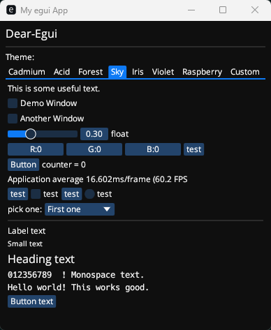

# dear_egui
A theme for [egui](https://github.com/emilk/egui) insipred by [Dear ImGui](https://github.com/ocornut/imgui)

## Instalation

Simply set the theme on the relevant egui context
```rs
dear_egui::colors::set_theme(&cc.egui_ctx, dear_egui::colors::SKY);
```

## Preview


